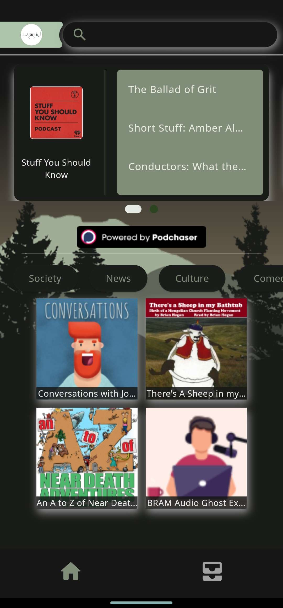
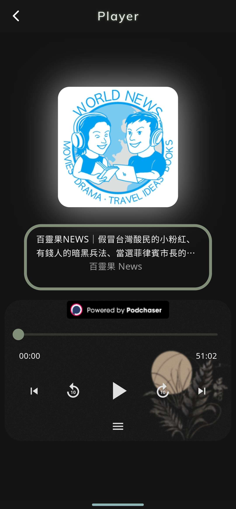

<h1>podivy (podcast player)</h1>

<h3>一個使用Flutter框架及做出來的podcast播放平台</h3>
  
實際畫面:

        
        

## 簡介
如果想了解APP的內部功能，你可以
1. 創建及登入帳號(目前方式有google、Email)
2. 搜尋podcast及相關節目
3. 播放podcast節目
4. 追隨podcast
5. 建立及編輯清單
6. 更改用戶資料(圖片及名稱)
7. 系統設定更改(主題、語言)
----
如果想了解APP的大概使用的工具，大致上有
1. Flutter狀態管理工具(`BLOC`(登入系統)、`Provider`(播放系統)、`GetX`(剩餘的其他功能))
2. 登入驗證系統使用**Firebase**
3. 資料庫使用**FireStore**
4. 資料來源來自[podchaser](https://www.podchaser.com/)
5. 用 **GraphQL** 來提取API資料
   

## 如何使用
預設帳號及密碼  
帳號: **testpodivy@gmail.com**  
密碼: **test123**    

請在這裡點擊[下載](https://drive.google.com/file/d/18aOoPdqKiVC0-2FyS1rBeRoaK7h1IpN6/view?usp=sharing) 或是 使用此專案  (閱讀下列須知)

> [!NOTE]  
> 使用APP時,  
> 如果資料無法顯示錯誤可能當月的token的資料提取已達到上限  
> 可能需要自行編譯執行

> [!IMPORTANT]  
> 執行專案時  
> - 因為這是我一人開發的專案(~~同時也是新手~~)，可能有很多變因可能導致無法執行或出現錯誤  
> 如果需要幫忙我會盡全力幫忙  
> - 請按照 **notice.env** 的指示來添加token

